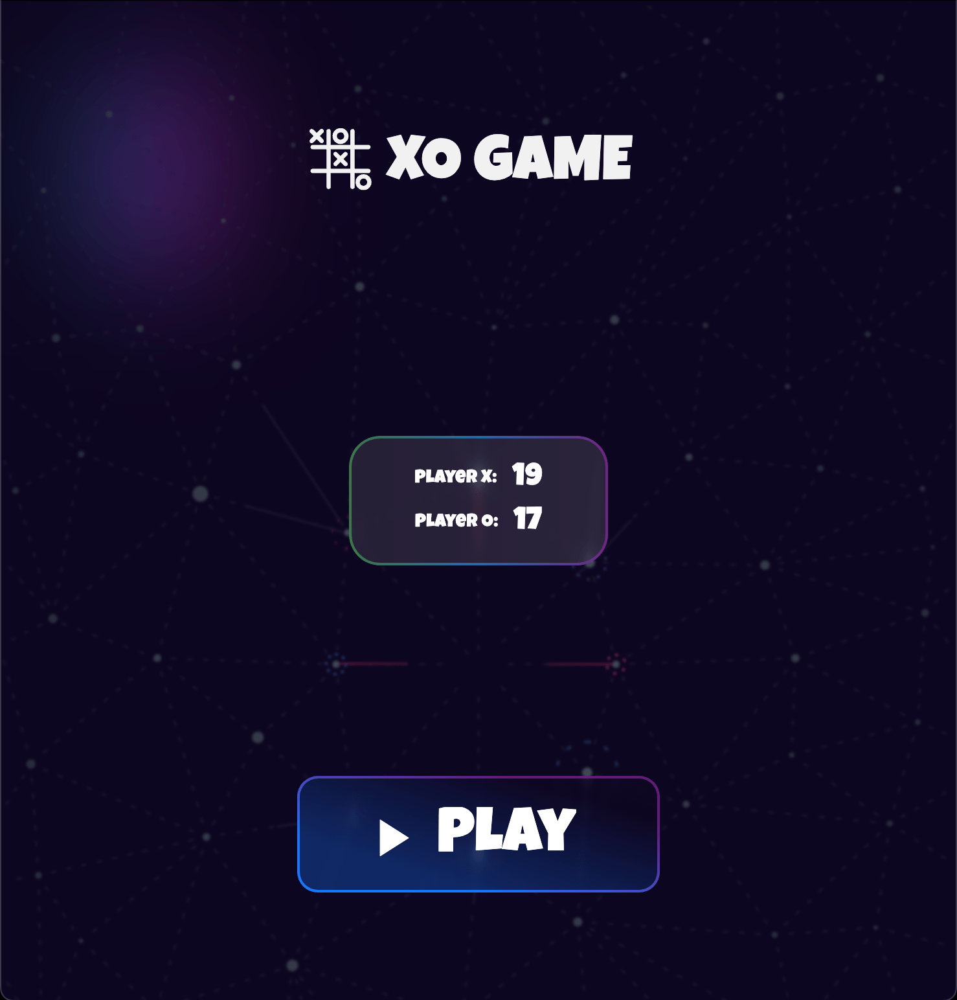
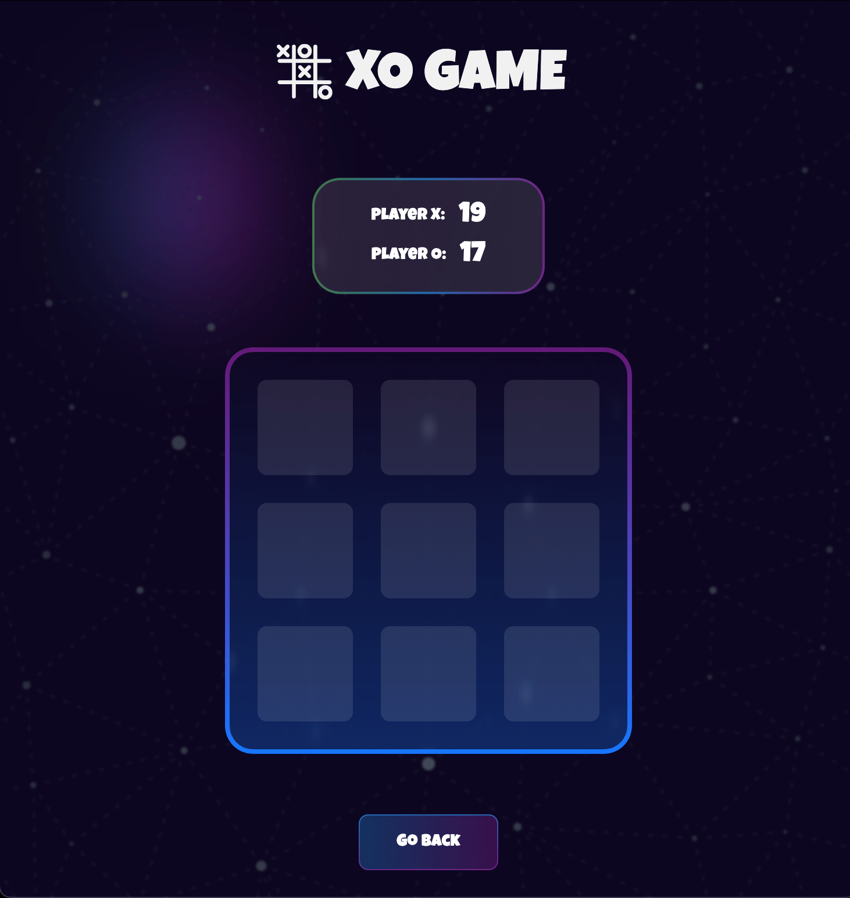
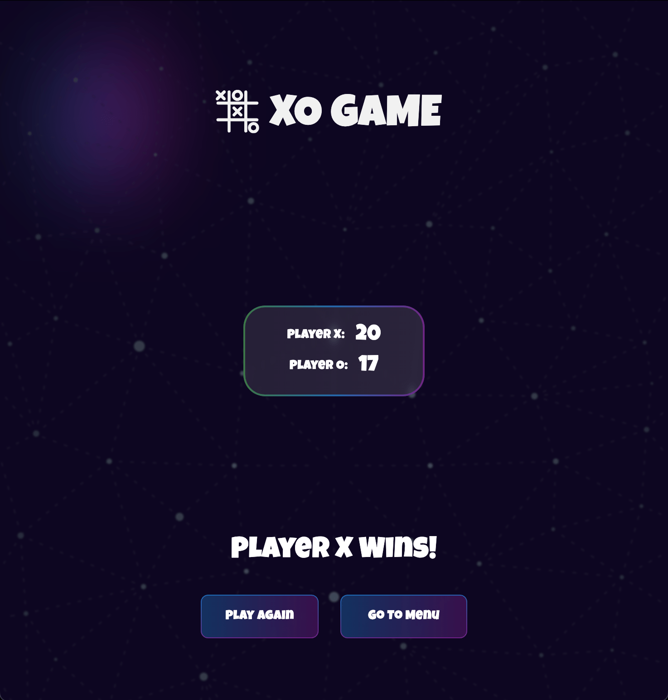

# xo_game

A Flutter app to play Tic Tac Toe with Neomorphic UI

Checkout the deployed app [here](https://tic-tac-toe-d159d.web.app/)

## Getting Started

1. Clone the repository  

    ```sh
    git clone git@github.com:Jerinji2016/xo_game.git
    ```  

2. Get dependencies and run

    ```sh
    flutter pub get && flutter run
    ```  

## Screenshots



***



***


